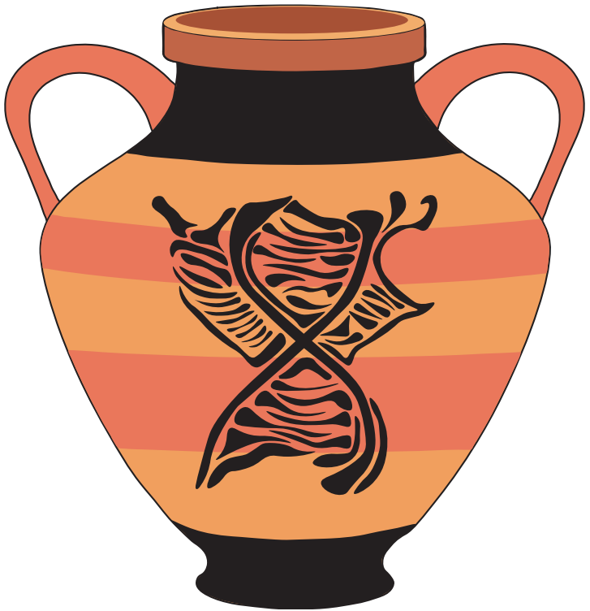

# Bacchus

BACterial CHromosome USeful tools for genomics study. (BACCHUS)
Functions for bacterial chromosome analysis.


<p align="center">
  
</p>


## Installation

To install this repository run the following commands:

```bash  
git clone https://github.com/ABignaud/bacchus.git
cd bacchus
pip install .
```

## Usage

To use bacchus functions import bacchus modules in python3 and then call the
function in python. Please read the doc for further help to specifically use
some functions.

## Aknowledgment 

The logo is the adaptation of an image produced using DALL-.E Mini image
generator (https://github.com/borisdayma/dalle-mini)